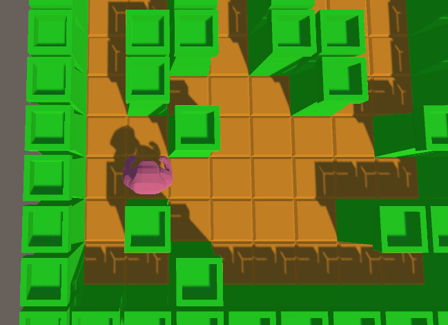

## aan de slag met unity

fork dit project:
https://github.com/progsen/cs_unity_programmatically_2dmaze

clone /download het naar je harde schijf

## meer in unity

- open het project in unity
- open de Maze scene

## start
 

in `GameEngine.cs` staat een 2 dimensionale array waar Tile(s) in zitten

eerst rij van Tiles (array van Tiles Tile[])
daarna de individueele Tiles van in die rij zitten

wat jullie gaan doen:

1) los de `???` op in de Tile class:
- laat Tile bijhouden of Tile een  `Tower` of `Ground` is. (bv een `bool`)
- laat Tile het `GameObject `(Unity) bijhouden 

2) in `GameEngine`
- los de `???` in `Start()` op

3) los in `Player` de `???` op
- in `DoMove` gebruik je Input (bv `GetKeyDown` ) om te kijken waar de player heen moet bewegen (`1 tegel per keer`). 
- Gebruik daar de `newPos` variable voor en de `Move` function
- verander de `newPos` voordat je deze doorgeeft bv: ga je naar rechts? `newPos.x = newPos.x+1`
- in `CanMoveTo` los het het `???` op, kijk of de `Tile` op `path[i][i2]` een toren is, als dat zo is `return false`

## extra:

Spawn ook een enemy

- breidt de Tile class uit met een `int`: `aStarValue`
- implementeer nu A* (zoek uit op het internet hoe dit moet) zodat de enemy elke stap van de speler probeert dichterbij te komen

https://en.wikipedia.org/wiki/A*_search_algorithm
